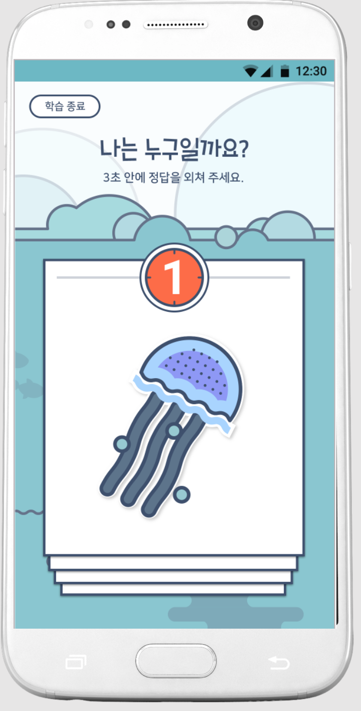
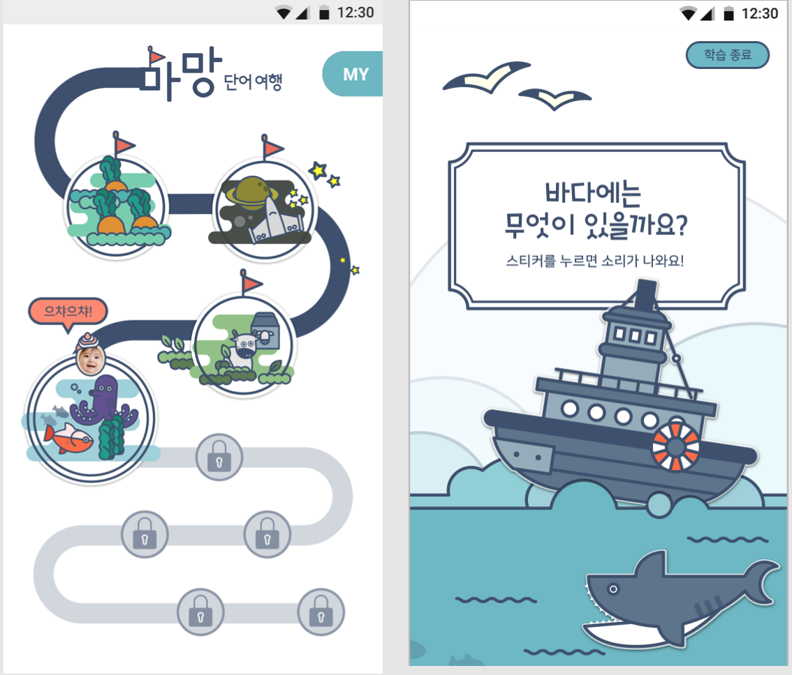
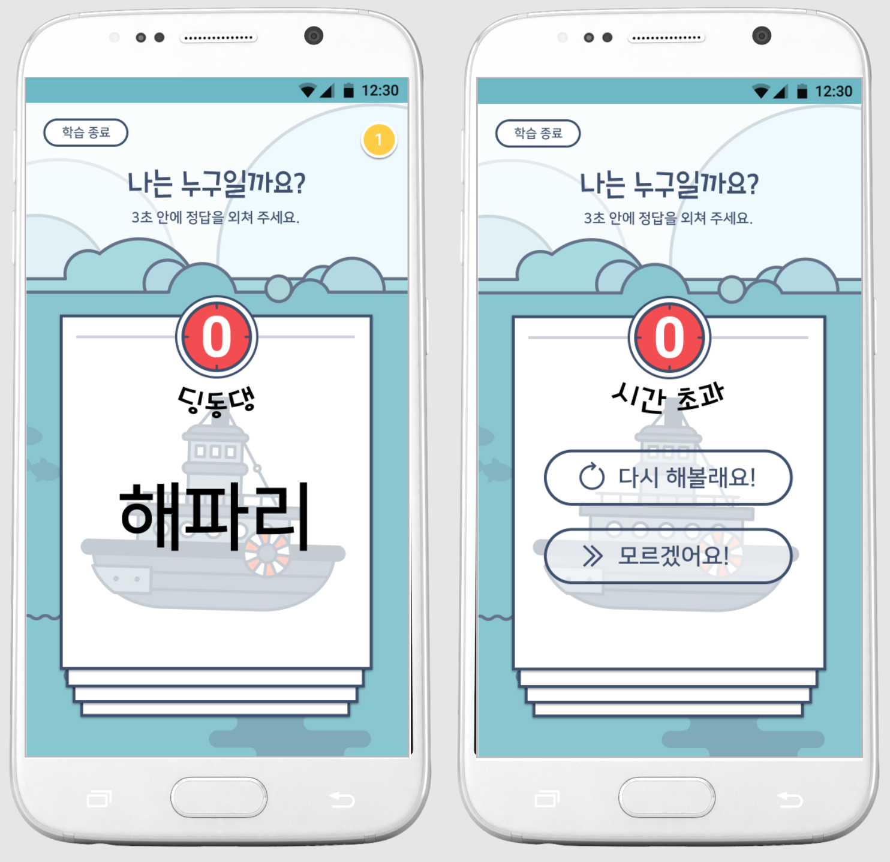
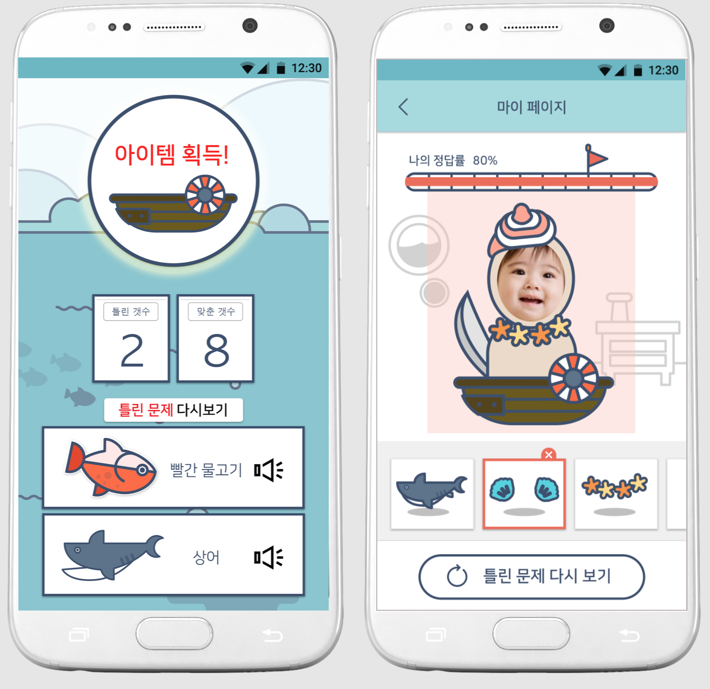
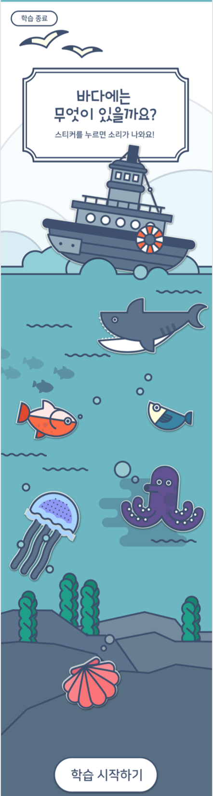

# UNITHON_MAMANG
This is a Speech correction app for children from multicultural families on South Korea.
Educational applications that help children of multicultural families who are vulnerable to language education.
70 percent of multicultural children under the age of 6 experience language delays. 
Voice recognition and voice synthesis API enables children to take fun, spontaneous pronunciation correction classes.

## Preview Image

 
 
 
 
 

## More Description
[Description PDF](https://github.com/hiasince/UNITHON_MAMANG/blob/master/Mamang_10.pdf)
